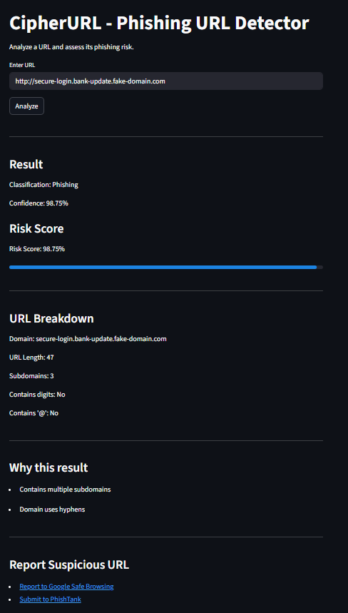

# CipherURL — Phishing URL Detection System

## Overview

CipherURL is a machine learning-based tool that classifies URLs as phishing or legitimate using an XGBoost model. The project focuses on detecting suspicious patterns in URLs and presenting results in a simple, explainable interface.

---

## Demo



---

## Features

* URL-based phishing detection
* Numeric risk score output
* Clear classification (Phishing / Safe)
* Explanation of why a URL is flagged
* URL structure breakdown
* External reporting via Google Safe Browsing and PhishTank

---

## Model Details

* Algorithm: XGBoost
* Dataset size: ~247,000 samples
* Features: 40+ engineered features
* Accuracy: ~93–95%
* Focus: improving recall to reduce missed phishing attacks

---

## How It Works

1. User enters a URL
2. Features are extracted from the URL
3. Model predicts phishing probability
4. Decision is made using a tuned threshold
5. Results and explanations are displayed

---

## Project Structure

```
cipherurl/
├── app/
│   └── app.py
├── src/
│   └── train.py
├── requirements.txt
├── screenshot.png
└── README.md
```

---

## Setup and Run

### Install dependencies

```
pip install -r requirements.txt
```

### Train the model

```
python src/train.py
```

### Run the application

```
streamlit run app/app.py
```

---

## Dataset

The dataset is not included in the repository due to size. It can be obtained from publicly available phishing datasets.

---

## Notes

* This project is intended for educational purposes
* Feature extraction in the UI is a simplified approximation
* Not intended for production security use

---

## About the Developer

### Abhishek M R

BCA Student | AI & Cybersecurity Enthusiast
